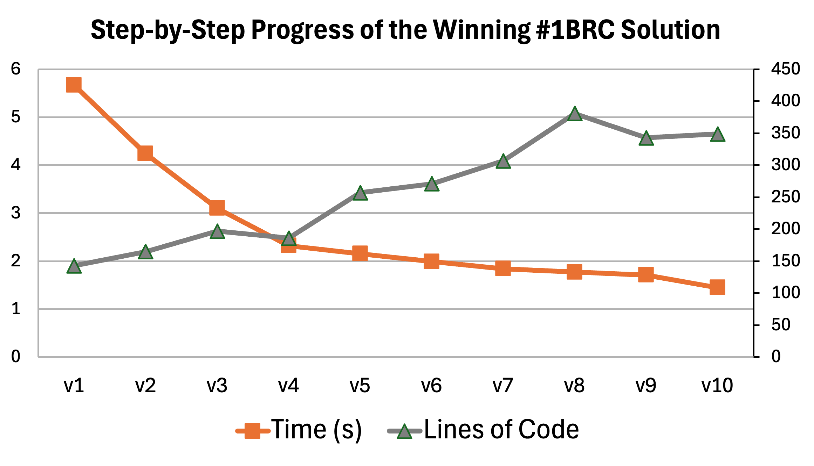
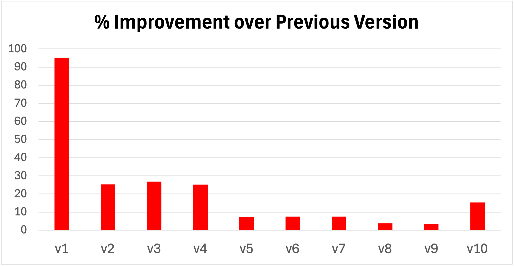
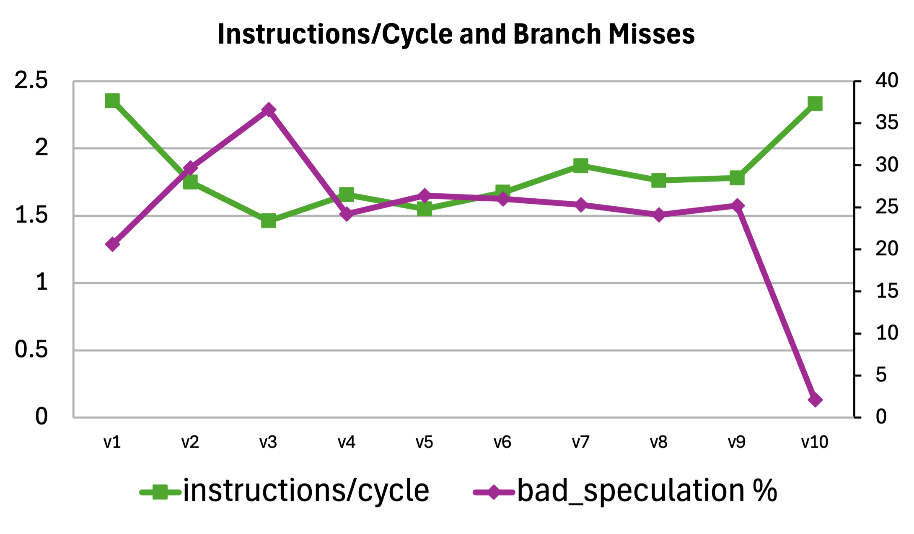

# Path to the Fastest #1BRC Solution

This repository contains 10 snapshots of the fastest [One Billion Row Challenge](https://github.com/gunnarmorling/1brc) solution to describe the incremental path to the final version. It describes the different optimization techniques and provides measurements of their impact. For general information on the contest and all submitted solutions, please visit the main [#1brc repository](https://github.com/gunnarmorling/1brc).

Also, there is a lot of other great content on the challenge if you are looking for more information, for example a [step by step guide from Marko Topolnik](https://questdb.io/blog/billion-row-challenge-step-by-step/) or a [talk by Roy van Rijn](https://www.youtube.com/watch?v=EFXxXFHpS0M) or a [podcast with Gunnar Morling](https://www.youtube.com/watch?v=RYjB4sGXNZI).

In the chart and table below, the 10 steps of the fastest solution are outlined. Each intermediate step is checked into the repository as a separate file. The summary chart shows how the optimizations applied in the first few versions made the biggest difference compared to the reference implementation. As the solution got more advanced, the incremental progress got smaller over time while the complexity of the solution continued to rise:

<p align="center">

</p>


The performance measurements were performed on an Intel 13th Gen Core i9-13900K while restricting the program to the first 8 cores using `taskset -c 0-7`. It is a comparable setup to the contest grading system, with only a few % difference.


| Code       | SLOC | Time (s) | Delta  | Description                                                                                                                                                                   |
|------------|------|----------|--------|-------------------------------------------------------------------------------------------------------------------------------------------------------------------------------|
| [ref](src/main/java/dev/morling/onebrc/CalculateAverage_baseline.java)  | 55   | 125.3    | -      | Naive single threaded reference implementation.                                                                                                                                                |
| [ref](src/main/java/dev/morling/onebrc/CalculateAverage_baseline.java)  | 55 | 115.1 | -8.2% | Exact same code as above, but using the [GraalVM](github.com/oracle/graal) JIT compiler, easy win by just switching the JDK distribution!
| [v1](src/main/java/dev/morling/onebrc/CalculateAverage_thomaswue_v1.java)  | 143  | 5.67     | -95.1% | Split input into 8 [segments](src/main/java/dev/morling/onebrc/CalculateAverage_thomaswue_v1.java#L167) and process them in [parallel](src/main/java/dev/morling/onebrc/CalculateAverage_thomaswue_v1.java#L81). Map the file into memory and use [byte buffer](src/main/java/dev/morling/onebrc/CalculateAverage_thomaswue_v1.java#L74) for parsing. Multiply input values by 10 and use [integer](src/main/java/dev/morling/onebrc/CalculateAverage_thomaswue_v1.java#L41) instead of double for intermediate calculations. Use a simple custom [hash table](src/main/java/dev/morling/onebrc/CalculateAverage_thomaswue_v1.java#L72) implementation. |
| [v2](src/main/java/dev/morling/onebrc/CalculateAverage_thomaswue_v2.java)  | 165  | 4.24     | -25.2% | [Use sun.misc.Unsafe](src/main/java/dev/morling/onebrc/CalculateAverage_thomaswue_v2.java#L103) instead of byte buffer to avoid bounds checks and indirections when parsing.   |
| [v3](src/main/java/dev/morling/onebrc/CalculateAverage_thomaswue_v3.java)  | 197  | 3.10     | -26.8% | Perform [scanning](src/main/java/dev/morling/onebrc/CalculateAverage_thomaswue_v3.java#L132) and [collision checking](src/main/java/dev/morling/onebrc/CalculateAverage_thomaswue_v3.java#L193) 4 or 8 bytes at a time.                                                                                                                             |
| [v4](src/main/java/dev/morling/onebrc/CalculateAverage_thomaswue_v4.java)  | 186  | 2.32     | -25.1% | Add [branchless temperature parsing](src/main/java/dev/morling/onebrc/CalculateAverage_thomaswue_v4.java#L207) and [SWAR scanning](src/main/java/dev/morling/onebrc/CalculateAverage_thomaswue_v4.java#L229) for delimiter.                                                                                                                |
| [v5](src/main/java/dev/morling/onebrc/CalculateAverage_thomaswue_v5.java)  | 257  | 2.15     | -7.3%  | Minor code shape improvements to [better specialize](src/main/java/dev/morling/onebrc/CalculateAverage_thomaswue_v5.java#L126) on the cases where the city name is <= 8 bytes or <= 16 bytes.                                                              |
| [v6](src/main/java/dev/morling/onebrc/CalculateAverage_thomaswue_v6.java)  | 271  | 1.99     | -7.5%  | [Reducing hash table size](src/main/java/dev/morling/onebrc/CalculateAverage_thomaswue_v6.java#L117) while still avoiding collisions in the example data set by adjusting the [hash function](src/main/java/dev/morling/onebrc/CalculateAverage_thomaswue_v6.java#L241).                                                                                                                       |
| [v7](src/main/java/dev/morling/onebrc/CalculateAverage_thomaswue_v7.java)  | 307  | 1.84     | -7.5%  | Adding trick to [spawn a subprocess](src/main/java/dev/morling/onebrc/CalculateAverage_thomaswue_v7.java#L115) to avoid the long wait until the Linux kernel unmapping of the file takes place.                                                            |
| [v8](src/main/java/dev/morling/onebrc/CalculateAverage_thomaswue_v8.java)  | 362  | 1.77     | -3.8%  | Better work distribution between threads by [processing in 2MB chunks](src/main/java/dev/morling/onebrc/CalculateAverage_thomaswue_v8.java#L278). Improved instruction level parallelism by processing always [three entries in parallel](src/main/java/dev/morling/onebrc/CalculateAverage_thomaswue_v8.java#L304) in the same thread.                                                              |
| [v9](src/main/java/dev/morling/onebrc/CalculateAverage_thomaswue_v9.java)  | 343  | 1.71     | -3.4%  | Save an instruction per row by [folding an addition into the x86 address calculation](https://github.com/thomaswue/1brc-steps/blob/main/src/main/java/dev/morling/onebrc/CalculateAverage_thomaswue_v9.java#L281) and another one by performing the check on the name length on [the mask value](src/main/java/dev/morling/onebrc/CalculateAverage_thomaswue_v9.java#L182).                                                                                                                          |
| [v10](src/main/java/dev/morling/onebrc/CalculateAverage_thomaswue_v10.java) | 349  | 1.45     | -15.4% | Remove the branch mispredictions by processing always [16 bytes at a time](src/main/java/dev/morling/onebrc/CalculateAverage_thomaswue_v10.java#L201) and using [masking instead of branches](src/main/java/dev/morling/onebrc/CalculateAverage_thomaswue_v10.java#L204) to process the city names.                                      |

GraalVM
====

As shown in the table above, just switching to the [GraalVM](github.com/oracle/graal) JDK distribution and using the Graal JIT compiler gives an 8% speed up for the reference implementation. Many participants therefore used GraalVM for their submissions. As the performance of submissions was getting better to below 10 seconds, also native image with its instant startup characteristics became important. For best performance, the following native image flags were used:

 ```
-O3                           # Running with the highest optimization level enabled.
-H:TuneInlinerExploration=1   # Maximum inlining exploration.
-march=native                 # Produce machine code best for the target machine.
--gc=epsilon                  # Disable garbage collection as it is not necessary.
```

Incremental Progress
====

As outlined in the following chart, the improvement of the first version in comparison to the reference implementation was very large with more than 95%. This was primarily due to using parallelism (factor 8) and optimizing data structures (int instead of double values). Those two aspects are often the most important ways to speed up a task.

<p align="center">

</p>


Branch Misses
====

While the incremental improvements between versions became smaller and smaller, the last version makes a big jump while not making any algorithmic or data structure changes. The improvement comes from a big change in instructions per cycle by eliminating branch misses. When looking at the number of instructions executed, the processor actually has to do *more* work, but because of the dramatically improved instruction level parallelism, it can do so in less cycles and therefore less time. The following chart illustrates this:

<p align="center">

</p>

[This GitHub comment on the PR](https://github.com/gunnarmorling/1brc/pull/702#issuecomment-1920922860) shows the detailed `perf stat` output that underlines this. The important parts are captured in the following simplified output from `perf stat`:

 ```
 BEFORE:
 Performance counter stats for './target/CalculateAverage_thomaswue_image':
       12,061.39 msec task-clock                                       
    25,250,300,213      cpu_core/cycles/                                  
    42,740,848,935      cpu_core/instructions/           #    1.69  insn per cycle              
     3,938,912,502      cpu_core/branches/               #  326.572 M/sec                       
       246,089,883      cpu_core/branch-misses/          #    6.25% of all branches             
             TopdownL1 (cpu_core)                 #     24.9 %  tma_bad_speculation      

AFTER:
 Performance counter stats for './target/CalculateAverage_thomaswue_image':
             9,778.04 msec task-clock                             
    21,654,496,541      cpu_core/cycles/                                   
    49,328,285,361      cpu_core/instructions/           #    2.28  insn per cycle            
     3,690,652,954      cpu_core/branches/               #  377.443 M/sec                      
        14,111,445      cpu_core/branch-misses/          #    0.38% of all branches          
             TopdownL1 (cpu_core)                 #     2.2 %  tma_bad_speculation    
```

Instead of missing 6.25% of all branches, the new version misses only 0.38% of all branches. Therefore a major bottleneck of instruction retirement is removed and `tma_bad_speculation` goes from 24.9% down to 2.2%.

The algorithmic change here was to not distinguish the case of a city name <= 8 characters and a city name <= 16 characters via branching. Instead, the program always reads ahead 16 characters and then uses masking to make sure only the actual city name is used for the calculation of the hash code and comparison with the stored hash key. It does mean that for the case of the city name being <= 8 characters, the processor is doing now more work. However, on average one branch miss every two rows (assuming a random distribution of city names in the input set) is avoided.

Using `perf stat` and looking at the `cpu_core/branch-misses` as well as the `tma_bad_speculation` data is a good way to understand whether the performance of your program is limited by branches.